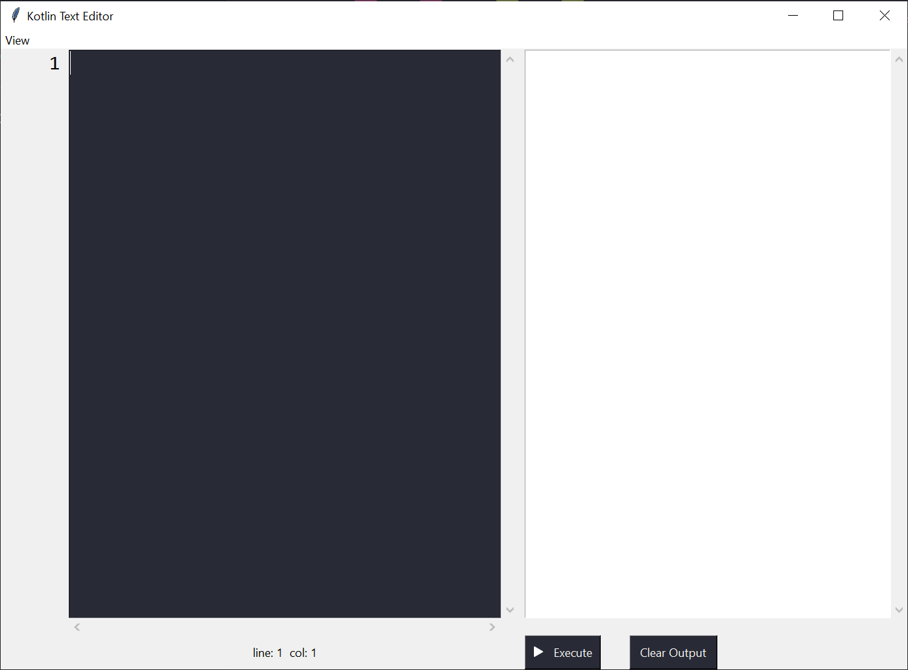
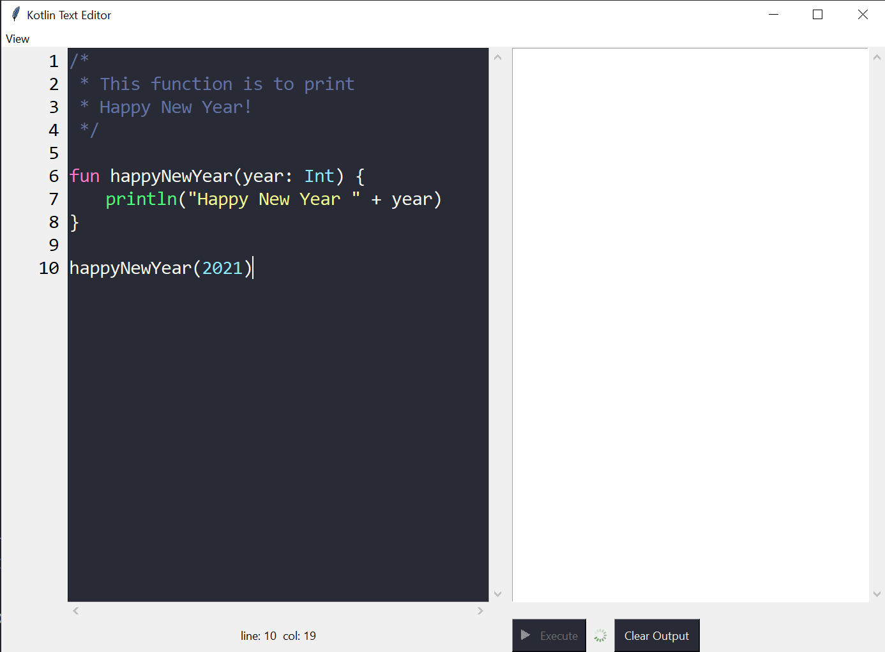
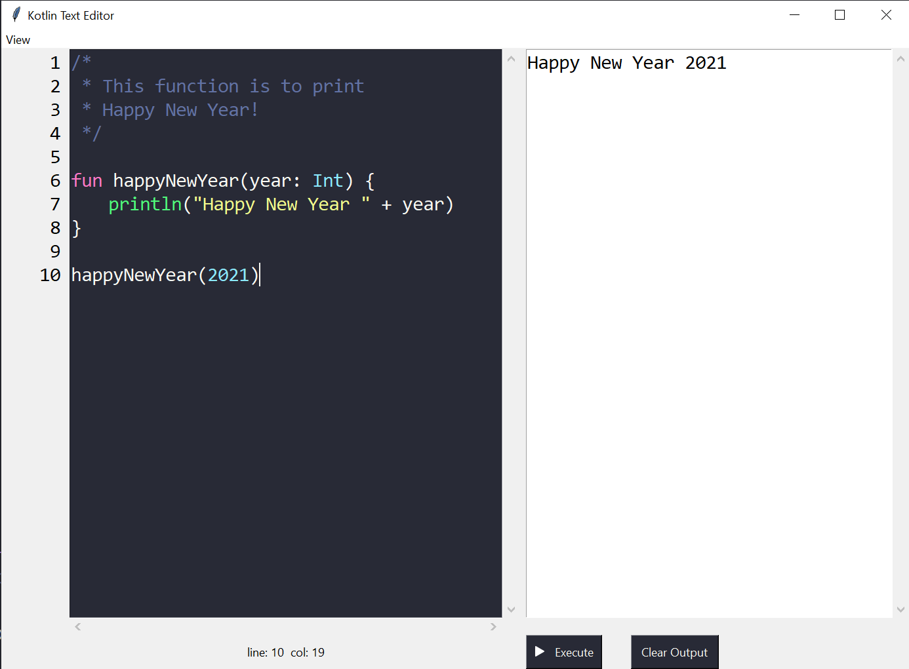
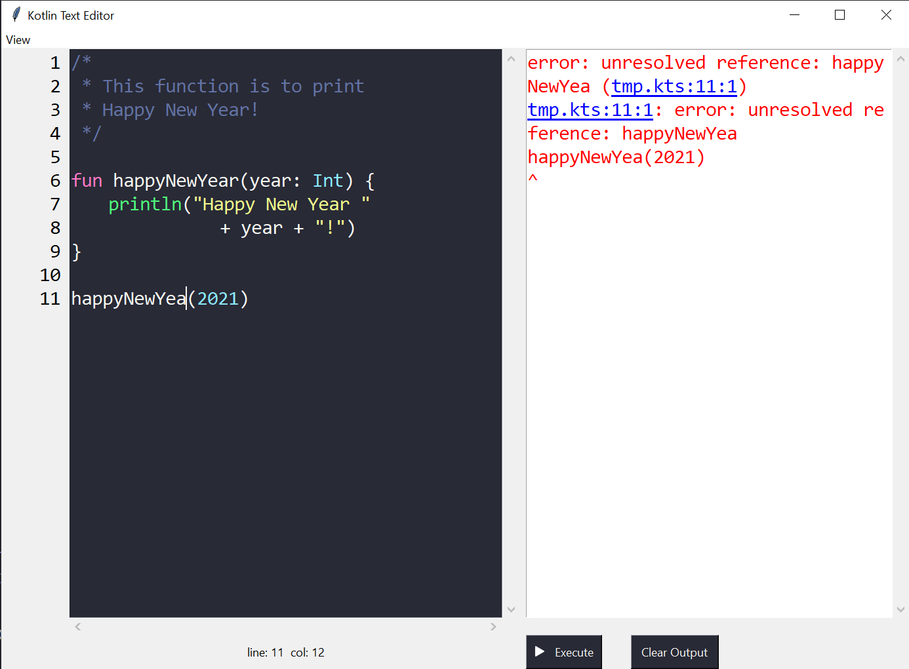
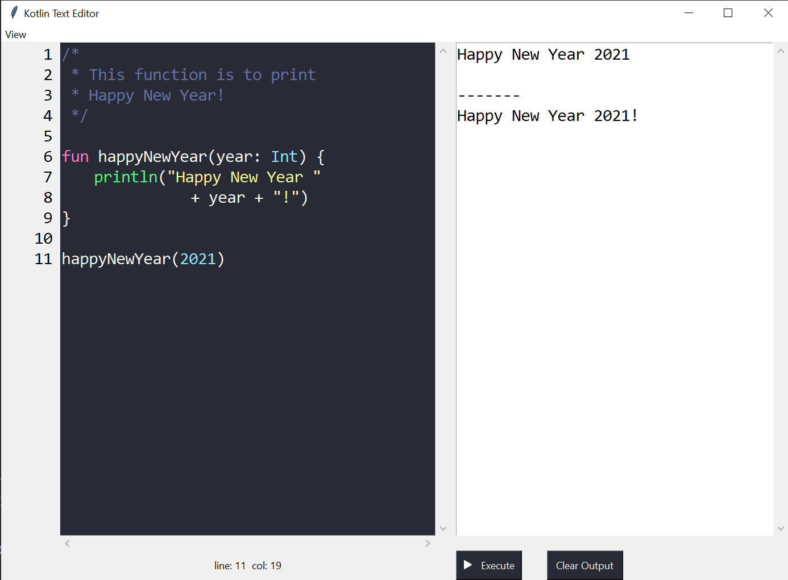

# Minimal Playground (Kotlin) Source Code Editor
This is a simple (Kotlin) source code editor that accepts typing in script and executes it.

The program was written with `Python 3.8` so it is required to have Python 3.x preinstalled on your machine.

## Tested environment
- OS: `Windows 10`
- Screen Resolution: `3840 x 2160`
- Python version: `Python 3.8`
- Java Development Kit (JDK) version: `Java SE Development Kit 8u271`

## Installation
- Install JDK, e.g. `Java SE Development Kit 8u271`
- Install `python 3.x`
- Install required python packages with command `pip install -r requirements.txt` where `requirements.txt` is located at `editor/`
- Install kotlin language (to execute kotlin script)
- Start up the python script at `editor/main.py` (No building required)

This should be the screen that you see when running the script successfully:

## Features
### Main features
- [x] Has an editor pane and an output pane
- [x] Supports kotlin script execution
- [x] Shows a spinner to indicate that the script is being executed
- [x] Highlights the error with red text and supports navigating to the error position by double-clicking on the location descriptions of the errors.
- [x] Highlights source code syntax using simple regular expressions (hard keywords, comments, strings, numbers, data types)
- [x] Supports adding other languages and editor themes by adding corresponding files to `editor/Common/languages/` and `editor/Common/themes/`

### Secondary (supporting) features
- [x] Supports line numbering for editor pane
- [x] Supports basic text manipulation shortcuts on editor pane such as select all, copy, paste, cut.
- [x] Shows line and col index of the current cursor position of editor pane
- [x] Has vertical and horizontal scroll bars for editor pane
- [x] Has vertical scroll bar for output pane
- [x] Has the option to clear the output of previous script runs
- [x] Supports changing font size for editor pane and output pane

## Demo images
As the script is being executed, the `Execute` button will be disabled and the text editor shows a spinner next to the `Execute` button

When the script finishes running, the output will be shown on the output pane

If the script cannot be executed successfully (due to errors, etc.) the output pane will show red text and double-clickable location descriptions of errors for users to refer to their true positions on editor pane.

If the script is run multiple times (may be because user changes minor thing on the code and re-executes), the output will be separated by a separation line. The whole output can be cleared using the `Clear Output` button on the editor.

